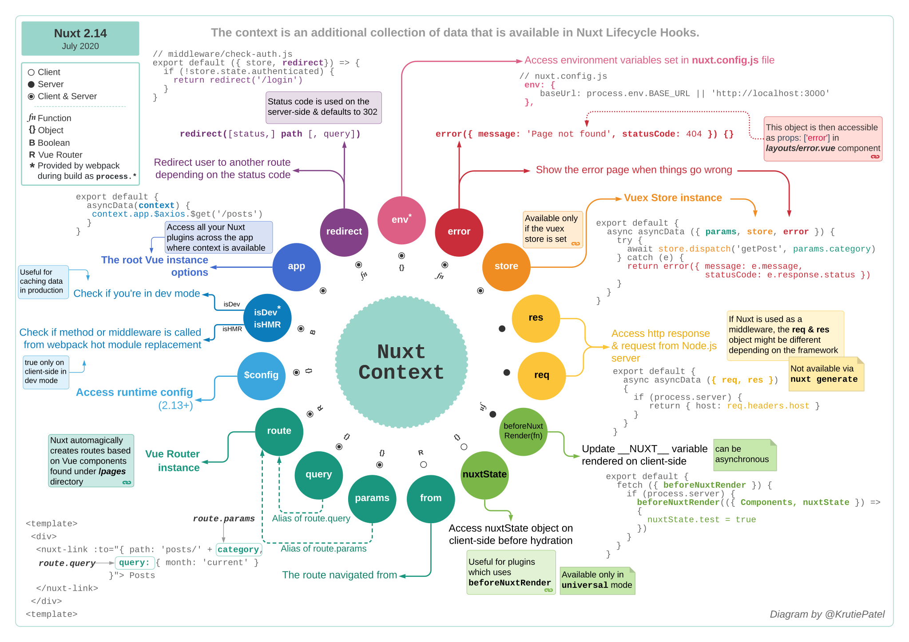

# context-helpers



## context

context 作为`asyncData`, `plugins`, `middleware` 和`nuxtServerInit`函数参数，提供和当前请求有关的信息

```js
function (context) { // Could be asyncData, nuxtServerInit, ...
  // Always available
  const {
    app,
    store,
    route,
    params,
    query,
    env,
    isDev,
    isHMR,
    redirect,
    error,
   $config
  } = context

  // Only available on the Server-side
  if (process.server) {
    const { req, res, beforeNuxtRender } = context
  }

  // Only available on the Client-side
  if (process.client) {
    const { from, nuxtState } = context
  }
}
```

> 此处说的`context`和vuex中action函数中的`context`参数，`nuxt.config.js`中的`build.extend`的`context`参数都是不一样的。

## context.params和context.error

```js
export default {
  async asyncData(context) {
    const id = context.params.id
    try {
      // Using the nuxtjs/http module here exposed via context.app
      const post = await context.app.$http.$get(
        `https://api.nuxtjs.dev/posts/${id}`
      )
      return { post }
    } catch (e) {
      context.error(e) // Show the nuxt error page with the thrown error
    }
  }
}
```

ES6解构

```js
export default {
  async asyncData({ params, $http, error }) {
    const id = params.id

    try {
      // Using the nuxtjs/http module here exposed via context.app
      const post = await $http.$get(`https://api.nuxtjs.dev/posts/${id}`)
      return { post }
    } catch (e) {
      error(e) // Show the nuxt error page with the thrown error
    }
  }
}
```